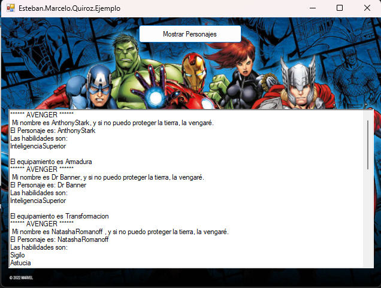

# Ejemplo primer parcial V2. 

## Proyecto: Marvel.

## Descripción
Este parcial fue tomado en el año 2021, los temas vistos son:
- Abstraccion, encapsulamiento, herencia, polimorfismo.
- windows form.
- proyecto de consola.
- Clases estaticas.
- Sobrecarga de operadores.

## Desarrollo de temas

- ### Sobrecarga de operadores:
    Se sobrecargo el operado "==" para retorne true si dentro de una lista se encuentra un objeto "personaje" ( Recordar si se sobrecarga el == tenemos que sobrecargar el != ).

~~~ C# (lenguaje en el que esta escrito)
        /// 

        /// Al igualar la lista de personajes con una personaje, devuelve si esta el personaje
        /// 

        /// <param name="listaPersonajes"></param>
        /// <param name="personaje"></param>
        /// <returns>retorna un true si esta el personaje </returns>
        public static bool operator ==(List<Personaje> listaPersonajes, Personaje personaje)
        {
            if (!(personaje is null))
            {
                foreach (Personaje auxPersonaje in listaPersonajes)
                {
                    if (auxPersonaje.nombre == personaje.nombre && auxPersonaje.GetType() == personaje.GetType())
                    {
                        return true;
                    }

                }
            }
            return false;
        }
~~~

---
